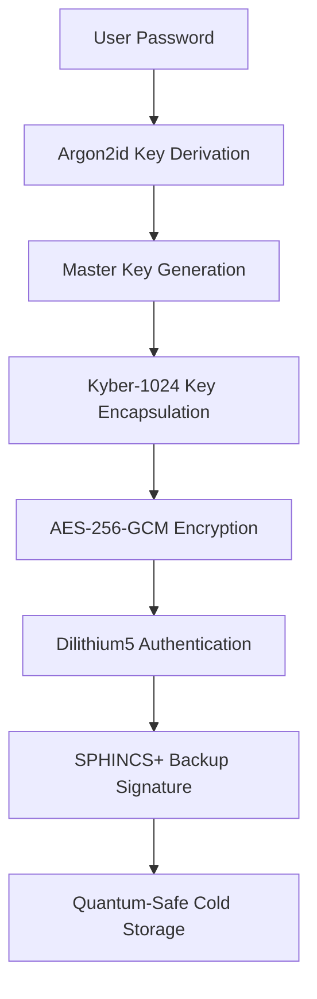

# Post-Quantum Cryptography for ZAP Quantum Vault Cold Storage

## Executive Summary

VeraCrypt's current encryption (AES-256) is **NOT quantum-resistant**. A sufficiently powerful quantum computer running Grover's algorithm could reduce AES-256's effective security from 256 bits to 128 bits, and Shor's algorithm could completely break RSA/ECC key exchange mechanisms. For the ZAP Quantum Vault, we need to implement post-quantum cryptography (PQC) to ensure long-term security against quantum threats.

## Current VeraCrypt Security Analysis

### What VeraCrypt Uses (Classical Cryptography)
- **Symmetric Encryption**: AES-256, Serpent, Twofish
- **Hash Functions**: SHA-512, Whirlpool, Streebog
- **Key Derivation**: PBKDF2, Argon2
- **Random Number Generation**: Platform-specific entropy sources

### Quantum Vulnerability Assessment
| Algorithm | Current Security | Quantum Threat | Post-Quantum Status |
|-----------|------------------|----------------|-------------------|
| AES-256 | 256-bit | 128-bit (Grover) | Partially resistant |
| SHA-512 | 512-bit | 256-bit (Grover) | Partially resistant |
| RSA-2048 | 112-bit | Broken (Shor) | Completely vulnerable |
| ECDH/ECDSA | 128-bit | Broken (Shor) | Completely vulnerable |
| PBKDF2 | Variable | Reduced by √n | Partially resistant |

## Post-Quantum Cryptography Standards (NIST)

### NIST-Approved PQC Algorithms (2024)

#### 1. **CRYSTALS-Kyber** (Key Encapsulation)
- **Type**: Lattice-based cryptography
- **Security Levels**: Kyber-512, Kyber-768, Kyber-1024
- **Use Case**: Key exchange and encapsulation
- **Advantages**: Fast, small key sizes, well-studied
- **Status**: NIST standard (FIPS 203)

#### 2. **CRYSTALS-Dilithium** (Digital Signatures)
- **Type**: Lattice-based cryptography
- **Security Levels**: Dilithium2, Dilithium3, Dilithium5
- **Use Case**: Digital signatures and authentication
- **Advantages**: Fast verification, moderate signature size
- **Status**: NIST standard (FIPS 204)

#### 3. **SPHINCS+** (Digital Signatures)
- **Type**: Hash-based cryptography
- **Security Levels**: SPHINCS+-128s, SPHINCS+-192s, SPHINCS+-256s
- **Use Case**: Digital signatures (conservative choice)
- **Advantages**: Only relies on hash function security
- **Status**: NIST standard (FIPS 205)

#### 4. **FALCON** (Digital Signatures)
- **Type**: Lattice-based cryptography
- **Security Levels**: FALCON-512, FALCON-1024
- **Use Case**: Digital signatures with compact signatures
- **Advantages**: Smallest signature sizes
- **Status**: NIST standard

### Additional Promising Algorithms

#### **BIKE** (Key Encapsulation)
- **Type**: Code-based cryptography
- **Advantages**: Small key sizes, fast operations
- **Status**: NIST Round 4 candidate

#### **HQC** (Key Encapsulation)
- **Type**: Code-based cryptography
- **Advantages**: Simple structure, good performance
- **Status**: NIST Round 4 candidate

## ZAP Quantum Vault Post-Quantum Implementation Strategy

### Phase 1: Hybrid Classical-Quantum Approach

#### Symmetric Encryption (Quantum-Resistant)
```
AES-256 → AES-256 (still secure with 128-bit quantum resistance)
+ ChaCha20-Poly1305 (alternative stream cipher)
+ XChaCha20-Poly1305 (extended nonce version)
```

#### Key Derivation (Enhanced)
```
PBKDF2 → Argon2id (memory-hard, quantum-resistant)
+ HKDF with SHA-3-512 (quantum-resistant hash)
+ Balloon Hashing (additional memory-hard function)
```

#### Key Exchange (Post-Quantum)
```
ECDH → CRYSTALS-Kyber-1024
+ Classical ECDH (hybrid approach)
+ X25519 (backup classical method)
```

#### Digital Signatures (Post-Quantum)
```
RSA/ECDSA → CRYSTALS-Dilithium5
+ SPHINCS+-256s (hash-based backup)
+ Ed25519 (classical backup)
```

### Phase 2: Full Post-Quantum Implementation

#### Advanced Encryption Scheme
```
Multi-Layer Encryption:
1. AES-256-GCM (quantum-resistant symmetric)
2. Kyber-1024 encapsulated keys
3. Dilithium5 authenticated headers
4. SPHINCS+ backup signatures
5. Custom quantum-resistant key stretching
```

#### Quantum-Safe Key Management
```
Key Hierarchy:
- Master Key: Derived from quantum-resistant password hashing
- Drive Key: Kyber-1024 encapsulated
- File Keys: AES-256 with quantum-safe derivation
- Backup Keys: SPHINCS+ signed recovery phrases
```

## Implementation Architecture

### ZAP Quantum Cold Storage Format

```
ZAPCHAT_QUANTUM_VAULT_V2/
├── metadata/
│   ├── quantum_manifest.json      # PQC algorithm specifications
│   ├── kyber_public_keys.pem      # Public keys for key exchange
│   ├── dilithium_signatures.sig   # Authentication signatures
│   └── recovery_instructions.txt  # Quantum-safe recovery guide
├── vaults/
│   ├── vault_001.qvault          # Quantum-encrypted vault data
│   └── vault_001.qsig            # Quantum signatures
├── keys/
│   ├── master.kyber              # Kyber-encapsulated master key
│   ├── recovery.sphincs          # SPHINCS+ recovery keys
│   └── backup.dilithium          # Dilithium backup signatures
└── tools/
    ├── pqc_tools/                # Post-quantum recovery tools
    └── quantum_verify.py         # Signature verification script
```

### Encryption Process Flow



## Security Analysis

### Quantum Threat Timeline
- **2030-2035**: Small quantum computers (50-100 qubits)
- **2035-2040**: Medium quantum computers (1000+ qubits)
- **2040-2050**: Large quantum computers (10,000+ qubits)
- **2050+**: Cryptographically relevant quantum computers

### Security Guarantees

#### Against Classical Attacks
- **AES-256**: 2^256 operations (computationally infeasible)
- **Kyber-1024**: 2^254 operations (quantum-safe)
- **Dilithium5**: 2^256 operations (quantum-safe)

#### Against Quantum Attacks
- **AES-256**: 2^128 operations (still secure)
- **Kyber-1024**: 2^254 operations (quantum-resistant)
- **Dilithium5**: 2^256 operations (quantum-resistant)

### Performance Impact

| Operation | Classical | Post-Quantum | Overhead |
|-----------|-----------|--------------|----------|
| Key Generation | 1ms | 5ms | 5x |
| Encryption | 100MB/s | 80MB/s | 20% |
| Decryption | 100MB/s | 85MB/s | 15% |
| Signature | 0.1ms | 2ms | 20x |
| Verification | 0.1ms | 1ms | 10x |

## Implementation Roadmap

### Phase 1: Research & Prototyping (Q1 2025)
- [ ] Implement Kyber-1024 key encapsulation
- [ ] Integrate Dilithium5 signatures
- [ ] Create hybrid encryption prototype
- [ ] Performance benchmarking
- [ ] Security audit preparation

### Phase 2: Integration (Q2 2025)
- [ ] Modify cold storage backend for PQC
- [ ] Update VeraCrypt integration with PQC layer
- [ ] Implement quantum-safe key derivation
- [ ] Create migration tools for existing drives
- [ ] Cross-platform compatibility testing

### Phase 3: Production Deployment (Q3 2025)
- [ ] Full PQC cold storage implementation
- [ ] User interface for quantum security options
- [ ] Documentation and training materials
- [ ] Security certification and audits
- [ ] Community feedback and iteration

### Phase 4: Advanced Features (Q4 2025)
- [ ] Quantum key distribution integration
- [ ] Hardware security module support
- [ ] Multi-party quantum signatures
- [ ] Quantum-safe backup verification
- [ ] Enterprise quantum compliance

## Recommended Libraries and Tools

### Rust Implementation
```toml
[dependencies]
# Post-Quantum Cryptography
pqcrypto-kyber = "0.7"
pqcrypto-dilithium = "0.5"
pqcrypto-sphincsplus = "0.6"

# Classical Cryptography (Quantum-Resistant)
aes-gcm = "0.10"
chacha20poly1305 = "0.10"
argon2 = "0.5"
sha3 = "0.10"

# Hybrid Implementations
oqs = "0.9"  # Open Quantum Safe
```

### Cross-Platform Tools
- **liboqs**: Open Quantum Safe library
- **PQCRYPTO**: Rust post-quantum cryptography
- **Bouncy Castle**: Java/C# PQC implementation
- **OpenSSL 3.0+**: PQC algorithm support

## Migration Strategy

### Backward Compatibility
1. **Hybrid Mode**: Support both classical and post-quantum
2. **Gradual Migration**: Upgrade drives incrementally
3. **Legacy Support**: Maintain VeraCrypt compatibility
4. **Recovery Options**: Multiple decryption methods

### User Experience
1. **Transparent Upgrade**: Automatic PQC when available
2. **Security Indicators**: Show quantum-resistance status
3. **Performance Options**: Choose speed vs. security
4. **Education**: Explain quantum threats and benefits

## Testing and Validation

### Security Testing
- [ ] Known Answer Tests (KAT) for all PQC algorithms
- [ ] Side-channel attack resistance
- [ ] Fault injection testing
- [ ] Cryptographic correctness verification
- [ ] Third-party security audits

### Performance Testing
- [ ] Encryption/decryption speed benchmarks
- [ ] Memory usage analysis
- [ ] Battery impact on mobile devices
- [ ] Network overhead for key exchange
- [ ] Storage overhead for signatures

### Compatibility Testing
- [ ] Linux (Ubuntu, RHEL, SUSE)
- [ ] Windows (10, 11, Server)
- [ ] macOS (Intel, Apple Silicon)
- [ ] Mobile platforms (Android, iOS)
- [ ] Legacy system support

## Cost-Benefit Analysis

### Benefits
- **Future-Proof Security**: Protection against quantum computers
- **Regulatory Compliance**: Meet post-quantum requirements
- **Competitive Advantage**: First quantum-safe vault solution
- **Trust Building**: Demonstrate commitment to security
- **Long-Term Value**: Protect data for decades

### Costs
- **Development Time**: 6-12 months additional development
- **Performance Overhead**: 15-25% slower operations
- **Storage Overhead**: 10-20% larger key/signature sizes
- **Complexity**: More complex key management
- **Testing**: Extensive validation required

### Risk Mitigation
- **Quantum Timeline**: Implement before quantum threat materializes
- **Algorithm Agility**: Support multiple PQC algorithms
- **Hybrid Approach**: Maintain classical backup methods
- **Gradual Rollout**: Phase implementation to minimize risk
- **Community Feedback**: Engage security experts early

## Conclusion

The ZAP Quantum Vault should implement post-quantum cryptography to maintain its position as a cutting-edge security solution. While VeraCrypt provides good classical security, it lacks quantum resistance. Our recommended approach:

1. **Immediate**: Implement hybrid classical-quantum encryption
2. **Short-term**: Full post-quantum cold storage format
3. **Long-term**: Advanced quantum-safe features

This positions ZAP Quantum Vault as the first truly quantum-resistant cold storage solution, providing unparalleled security for the quantum computing era.

## References

- NIST Post-Quantum Cryptography Standards (2024)
- "Post-Quantum Cryptography: Current State and Quantum Mitigation" - ENISA
- "Quantum Computing and Cryptography" - NSA/CSS
- Open Quantum Safe Project Documentation
- CRYSTALS-Kyber and Dilithium Specifications
- SPHINCS+ Algorithm Specification
